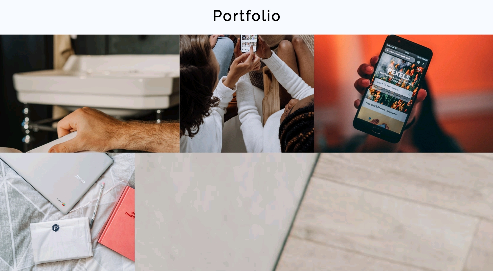

# CodersCamp 2020 - Projekt HTML & CSS
**Projekt — Wizytówka / Portfolio wykonany w ramach bootcampu CodersCamp** 

[Link do mojego portfolio](https://kgutka.github.io/portfolio/)

### W projekcie postarałam się zaprezentować praktyczną znajomość poniższych zagadnień związanych z HTML & CSS:
- Box-model
- Kaskadowość CSS
- Selektory CSS
- Popularne tagi HTML
- Jak podpinać CSSa do HTMLa
- Zapisywanie kolorów
- Stylowanie tekstu
- Zewnętrzne ikony/fonty (fontawesome, google fonts)
- Flexbox i/lub CSS Grid
- Position (absolute, relative)
- Animacje keyframes
- Formularz (wysłanie formularza może powodować przeładowanie strony, gdyż w kursie nie było jeszcze jego obsługi)
- Responsive Web Design

Nie korzystano z JavaScriptu ani żadnego innego frameworka. 
Nie korzystano też z gotowych bibliotek styli takich jak Bootstrap.

## Opis projektu
Przy wykonaniu projektu wzorowałam się na szablonie dostępnym pod linkiem:
https://www.figma.com/file/WHtiMfcNHt4tc7mDamNBYa/CodersCamp2020-Wizytowka?node-id=0%3A1

#### Organizacja strony
Moją stronę - wizytówkę podzieliłam na 6 sekcji:
* nagłówek z powitaniem,
* "About me" - opis mojej osoby,
* "Skills" - opis moich umiejętności,
* "Portfolio" - zbiór przykładowych projektów wykonanych przeze mnie,
* "Contact" - sekcja strony zawierająca moje dane kontaktowe,
* stopka strony z animacją i informacją o prawach autorskich do strony.

#### Responsywność
Strona została wykonana z podejściem Mobile-First, co oznacza rozpoczęcie projektowania od najmniejszego urządzenia oraz najniższej rozdzielczości, a następnie adaptacja do coraz większych urządzeń (z większą rozdzielczością).

Break points zostały podzielone na:
* 480px,
* 768px,
* 1024px,
* 1200px,
* 1450px.

### Header
Nagłówek wygląda podobnie na urządzeniach mobilnych oraz desktopowych.
Na stronie wykorzystałam Sticky Menu, dzięki czemu jest ono widoczne w każdym miejscu podczas przeglądania strony.

### About me
W tej sekcji umieściłam informacje taki jak: imię, wiek, profil pracy, numer telefonu i adres e-mail oraz napisałam kilka słów o sobie (na potrzeby dema - Lorem Ipsum).

Wygląd sekcji na urządzeniu mobilnym:

### Skills
Każda umiejętność mieści się w jednym kafelku.

### Portfolio
Galeria projektów została utworzona przy pomocy grid'a, każdy projekt mieści się w innym kafelku.

Po najechaniu na obrazek pojawia się opis projektu z linkiem do niego.
Przykład:

### Contact
Ta sekcja zawiera 6 metod kontaktu ze mną, poprzez:
* formularz na stronie,
* numer telefonu,
* adres e-mail,
* profil na GitLabie,
* profil na LinkedInie,
* profil na GitHubie.

### Stopka
W stopce została umieszczona animacja pieska.

